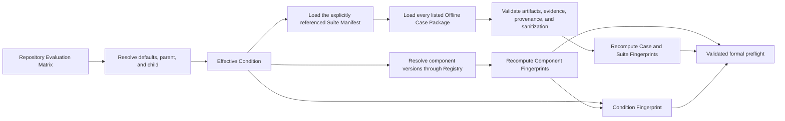

# Evaluation Matrix、Component Registry 与 Offline Evaluation Suite

本文统一说明 DevAgentOps 当前已经实现的正式评测配置与离线评测数据契约，对应：

- Issue #4：Evaluation Matrix；
- Issue #5：Component Registry；
- Issue #6：Offline Case Package 与 Evaluation Suite Manifest Loader。

它们共同解决正式评测的可复现性问题：

| 层次 | 要回答的问题 | 当前实现 |
|------|--------------|----------|
| Evaluation Matrix | 一次实验实际使用了什么配置？ | 解析完整 Effective Condition，并计算 Condition Fingerprint |
| Component Registry | 配置中引用的组件版本是否仍代表原来的行为内容？ | 冻结 Component Manifest，并校验 Component Fingerprint |
| Offline Case Package | 单个评测 Case 的输入、评分语义、证据和正式资格是否完整且未漂移？ | 校验 Case Schema、Artifact、Evidence、Provenance、Sanitization 与 Case Fingerprint |
| Evaluation Suite Manifest | 正式评测明确包含哪些 Case 和权重？ | 按 Manifest 显式加载 Case，并校验 Suite Fingerprint，不扫描目录 |

Issue #4 防止 Condition ID 背后的实验配置静默变化，Issue #5 防止 Component Version 背后的 Prompt、Tool、Retriever 或 Policy 行为静默变化，Issue #6 则防止 Suite ID 或 Case ID 背后的评测数据和评分语义静默变化。

## 完整校验链



这条链当前只验证配置，不执行 Agent、模型或 Scorer。通过校验意味着“这份配置具有稳定、可检查的身份”，不意味着正式评测运行已经发生。

## 1. Evaluation Matrix 规则

Evaluation Matrix 是仓库管理的正式实验设计文件。它不是任意运行参数列表，而是一组经过控制的比较条件。

### 1.1 Matrix 顶层字段

Matrix 只接受以下顶层字段：

| 字段 | 是否必需 | 含义 |
|------|----------|------|
| `matrix_id` | 是 | Matrix 的稳定名称 |
| `matrix_version` | 是 | 当前实验设计版本 |
| `schema_version` | 是 | Matrix 文件格式版本；当前 loader 会记录该值，但尚未限制具体支持值 |
| `defaults` | 否 | 所有 Condition 共享的默认配置 |
| `conditions` | 是 | Condition 列表 |

未知顶层字段会被拒绝，避免拼写错误悄悄进入实验配置。

### 1.2 Condition 字段

每个 Condition 可以声明：

- `id`：Condition 名称，Matrix 内必须唯一；
- `extends`：可选的父 Condition；
- `type`：`anchor`、`ablation` 或 `candidate`；
- `runtime_variant`；
- `suite`；
- `evaluation_method`；
- `model`；
- `components`；
- `budgets`；
- `repeats`。

解析完成后的 Effective Condition 必须包含除 `id` 和 `extends` 以外的八个配置字段。Condition 类型目前只参与枚举校验；不同类型的更高层发布或排行榜策略尚未由 loader 执行。

三类 Condition 的设计意图是：

| 类型 | 用途 |
|------|------|
| `anchor` | 稳定参照条件，用于解释方法、Suite 或 Runtime 变化后的结果移动 |
| `ablation` | 相对参照条件只改变一个主要变量，帮助定位能力来源 |
| `candidate` | 产品相关的完整候选配置 |

V1 使用受控条件集合，不生成所有 Runtime、Model、Retriever、Tool 和 Prompt 的笛卡尔积。

ADR 0124 已接受 Oracle Evidence Diagnostic Condition 作为未来的受控诊断条件。它不是新的 `runtime_variant`：未来 Schema 必须显式记录并 Fingerprint Evidence Delivery Mode 或等价版本化契约。当前严格字段集合尚不接受该字段，因此本节不是可执行配置说明。

### 1.3 Defaults 与一层继承

Effective Condition 的解析优先级是：

```text
defaults < parent condition < child condition
```

后面的值覆盖前面的值。嵌套对象递归合并，例如 Child 可以只覆盖 `budgets.max_steps`，同时继承其他 Budget 字段。

V1 只允许一层 `extends`：

```text
child -> parent        允许
grandchild -> child -> parent    拒绝
```

同时拒绝：

- 不存在的父 Condition；
- Condition 继承循环；
- 重复的 Condition ID；
- 未知字段；
- 不支持的 Condition Type；
- 解析后仍缺失的必需字段。

`id` 和 `extends` 是命名与配置复用机制，不进入 Effective Condition。

### 1.4 Matrix 示例

```json
{
  "matrix_id": "triage-v1",
  "matrix_version": "1",
  "schema_version": "1",
  "defaults": {
    "suite": "triage-suite-v1",
    "evaluation_method": "triage-method-v1",
    "model": {
      "provider": "openai-compatible",
      "name": "test-model",
      "temperature": 0
    },
    "components": {
      "prompt": "triage-prompt-v1",
      "tool_registry": "triage-tools-v1",
      "retriever": "none-v1",
      "tool_policy": "read-only-v1",
      "mcp_server_set": "none-v1",
      "skill_registry": "none-v1"
    },
    "budgets": {
      "max_steps": 8,
      "max_tokens": 4096
    },
    "repeats": 1
  },
  "conditions": [
    {
      "id": "pipeline-anchor-v1",
      "type": "anchor",
      "runtime_variant": "pipeline"
    },
    {
      "id": "react-retrieval-ablation-v1",
      "extends": "pipeline-anchor-v1",
      "type": "ablation",
      "runtime_variant": "react",
      "components": {
        "retriever": "hybrid-v1"
      }
    }
  ]
}
```

示例中的 Component Version 必须先存在于 Registry，才能通过正式校验。仓库当前的 `components/registry.json` 是空的初始结构，不预先声明这些示例版本。

### 1.5 Effective Condition 与 Condition Fingerprint

Loader 会先解析完整 Effective Condition，再把规范化 JSON 做 SHA-256：

- JSON Key 顺序和缩进不影响 Fingerprint；
- Defaults 或 Parent 中继承来的值会进入 Fingerprint；
- `condition_id`、`extends`、Matrix 排版不进入 Fingerprint；
- 两个不同 ID 如果解析成相同 Effective Condition，会得到相同的结构 Fingerprint。

在正式 Registry 校验模式下，已验证的 Component Fingerprint 也会进入 Condition Fingerprint 输入。因此，同一个 Component Version 如果指向不同的行为内容，不可能继续产生可信的相同 Condition 身份。

Condition Fingerprint 证明单个 Condition 的内容身份，没有要求两个不同受控条件产生同一个 Fingerprint。普通 Leaderboard 仍按相同 Method、Suite 和 Model Configuration 分区；Oracle-versus-Agent 之类的专门 Pair Analysis 应验证各自 Fingerprint，并另外检查声明的 Pairing Keys 和唯一计划内差异，不能把不同 Condition 伪装成相同身份。

## 2. Component Registry 规则

Matrix 中的 `components` 只保存人类可读的 Version，例如 `triage-prompt-v1`。Version 本身只是标签；如果文件内容可以在不改 Version 的情况下变化，Matrix 仍然不可复现。

Component Registry 为这个标签增加内容身份：

```text
Component Type + Component Version
    -> Frozen Manifest Path
    -> Component Fingerprint
```

### 2.1 六类组件

V1 支持以下 Component Type：

| Component Type | 必需 Behavior 字段 | 可选 Behavior 字段 |
|----------------|---------------------|---------------------|
| `prompt` | `template` | `variables` |
| `tool_registry` | `tools` | 无 |
| `retriever_config` | `strategy`、`settings` | 无 |
| `tool_policy` | `rules` | `default_action` |
| `mcp_server_set` | `servers` | 无 |
| `skill_registry` | `skills` | 无 |

未知 Behavior 字段会被拒绝。`tools`、`rules`、`servers` 和 `skills` 必须是对象列表；空列表可以诚实表达 V1 尚未实现的 MCP 或 Skill 能力。

Model Configuration 不属于 Component Registry。它独立保存在 Matrix 和未来的 Run Manifest 中，因为 Model 不是仓库内可冻结的行为组件文件。

### 2.2 Manifest Envelope

Schema Version 1 Manifest 使用严格结构：

```json
{
  "schema_version": "1",
  "component_type": "prompt",
  "component_version": "draft",
  "behavior": {
    "template": "Diagnose the failure using evidence from {log}.",
    "variables": ["log"]
  },
  "metadata": {
    "author": "example",
    "notes": "Review context only."
  }
}
```

字段规则：

- 必需：`schema_version`、`component_type`、`behavior`；
- 可选：`component_version`、`metadata`；
- 未知顶层字段拒绝；
- 当前只接受 Manifest `schema_version: "1"`；
- Draft 可以省略 `component_version`，或使用 Draft 名称；
- 所有行为相关配置必须放在 `behavior`；
- 作者、说明、时间等审阅信息放在 `metadata`。

### 2.3 Component Fingerprint

Schema Version 1 只对规范化后的 `behavior` 对象做 SHA-256：

```text
fingerprint = SHA256(canonical_json(manifest.behavior))
```

因此：

- 修改缩进或 Key 顺序不会改变 Fingerprint；
- 修改 `metadata` 不会改变 Fingerprint；
- 修改任何 Behavior 字段都会改变 Fingerprint；
- Component Type 和 Version 由 Registry 索引与 Manifest 字段另行校验，不混入 Behavior Hash。

这个边界要求作者正确分类字段。把真正影响行为的配置错误地放入 `metadata`，会让变更逃离 Fingerprint；Manifest Schema 的目的之一就是让这种分类可以审查。

### 2.4 Draft、Validate 与 Freeze

Draft Manifest 可以在本地自由修改，但不能进入正式 Matrix 比较。工作流是：

```text
edit draft
  -> component validate
  -> local review or experimentation
  -> component freeze with a new version
  -> update Matrix reference
  -> formal eval doctor
```

Validate 只检查 Manifest 并输出当前 Fingerprint：

```bash
devagentops component validate \
  --manifest components/drafts/prompt.json
```

Freeze 会：

1. 校验 Manifest Schema 与 Component Type；
2. 计算 Canonical Component Fingerprint；
3. 把 Manifest 写入 `components/frozen/<type>/<version>.json`；
4. 把 Manifest Path、Fingerprint、`frozen_at` 和 Metadata 写入 Registry；
5. 把请求的 Version 写入 Frozen Manifest。

```bash
devagentops component freeze \
  --manifest components/drafts/prompt.json \
  --registry components/registry.json \
  --version triage-prompt-v1
```

同一 Version、同一 Behavior 的重复 Freeze 是幂等的。同一 Type 和 Version 如果对应不同 Behavior，则必须创建新 Version；系统会拒绝覆盖，这种冲突称为 Version Pollution。

### 2.5 Registry Record

Registry 按 Component Type 和 Version 组织，只记录 Frozen Component：

```json
{
  "schema_version": "1",
  "components": {
    "prompt": {
      "triage-prompt-v1": {
        "manifest": "frozen/prompt/triage-prompt-v1.json",
        "fingerprint": "<64-character sha256>",
        "frozen_at": "2026-08-05T00:00:00Z",
        "metadata": {
          "notes": "Reviewed V1 prompt"
        }
      }
    }
  }
}
```

Manifest Path 必须位于 Registry 目录内。正式校验不会只相信 Registry 中保存的 Fingerprint，而会重新读取 Manifest、重新计算 Fingerprint，再与记录比较。

## 3. Matrix 与 Registry 的连接规则

Matrix Component Key 与 Registry Component Type 的映射是：

| Matrix Key | Registry Type | 说明 |
|------------|---------------|------|
| `prompt` | `prompt` | 直接映射 |
| `tool_registry` | `tool_registry` | 直接映射 |
| `retriever` | `retriever_config` | Issue #4 兼容名称 |
| `retriever_config` | `retriever_config` | 规范名称 |
| `tool_policy` | `tool_policy` | 直接映射 |
| `mcp_server_set` | `mcp_server_set` | 直接映射 |
| `skill_registry` | `skill_registry` | 直接映射 |

同一个 Condition 不能同时声明 `retriever` 和 `retriever_config`，因为它们代表同一组件类型，会产生歧义。

正式校验会拒绝：

- Draft Version；
- Registry 中不存在的 Version；
- 不支持的 Component Key；
- 同一 Component Type 的别名冲突；
- Registry Record 缺字段或字段类型错误；
- Manifest Path 逃出 Registry 目录；
- Registry Type 与 Manifest Type 不一致；
- Registry Version 与 Manifest Version 不一致；
- 保存的 Fingerprint 与重新计算的 Fingerprint 不一致。

## 4. Offline Case Package 规则

Issue #22 把本地离线评测数据完整性边界升级为 Schema V2：在调用模型或 Scorer 之前，先证明 Case 的 Physical Artifacts、Canonical Evidence、Evaluator Ground Truth、正式资格和内容身份都有效。

它不运行 Agent，不连接在线 CI，也不执行评分。

### 4.1 Case Manifest Schema Version 2

每个 Case 目录包含一个 `case.json`：

```json
{
  "case_schema_version": "2",
  "case_id": "constructed-assertion-001",
  "artifacts": {
    "raw_log": "physical-artifacts/raw.log",
    "repository_manifest": "physical-artifacts/repository-manifest.json",
    "repository_root": "physical-artifacts/repository",
    "log_units": "canonical-evidence/log-units.json",
    "repository_units": "canonical-evidence/repository-units.json",
    "required_evidence": "evaluator/required-evidence.json",
    "expected_answer": "evaluator/expected-answer.json"
  },
  "forbidden_actions": ["edit_code", "rerun_ci"],
  "provenance": {
    "source_type": "constructed",
    "source_url_or_construction_note": "为 Loader 测试构造的独立合成 Case。",
    "license_or_permission": "project_constructed"
  },
  "curation": {
    "created_by": "case author",
    "review_status": "human_reviewed",
    "reviewed_by": "human reviewer"
  },
  "sanitization": {
    "status": "reviewed_no_changes",
    "reviewed_by": "human reviewer",
    "transformations": []
  },
  "case_fingerprint": "<64-character sha256>"
}
```

Manifest 使用严格字段集合，未知字段和缺失字段都会被拒绝。Loader 只接受 `case_schema_version: "2"`：字段缺失或类型错误是 `invalid_case_manifest`，显式旧/未知版本是 `unsupported_case_schema_version`。Schema V1 不再兼容。

### 4.2 Case Artifact 契约

| Artifact | Schema 与要求 |
|----------|---------------|
| `physical-artifacts/raw.log` | 非空 UTF-8 bytes，保存冻结的原始 CI/Test 日志 |
| `physical-artifacts/repository-manifest.json` | upstream identity、`git_commit` 或 `constructed_snapshot` exact revision，以及每个冻结成员的规范化 path、SHA-256、byte size |
| `physical-artifacts/repository/` | Manifest-driven bounded snapshot；拒绝缺失、额外、重复、hash/size 不符或任何 symlink member |
| `canonical-evidence/*-units.json` | 只保存 answer-neutral Evidence ID、physical source、1-based inclusive line range 与 exact selected bytes SHA-256，不复制 evidence body |
| `evaluator/required-evidence.json` | 独立 Evidence Ground Truth；Required 非空，Optional 可空，均唯一、互斥且必须引用 Canonical ID |
| `evaluator/expected-answer.json` | Diagnosis Ground Truth；只含 Primary/Acceptable Failure Type、Summary、Root Cause 与 Recommended Action |
| `forbidden_actions` | 非空且不重复的禁止操作列表，用于声明该 Case 不允许的 Mutation 行为 |

Log Unit 的 `source` 必须严格等于 manifest 的 `raw_log`。Repository Unit 的 `source` 必须位于 declared `repository_root` 且对应 repository manifest 中的 frozen member。Line terminator 属于 resolved bytes；CRLF 不 normalize；最后一行没有 LF 仍有效；空 span 与越过 EOF 的 span 均拒绝。

### 4.3 三层信任边界

实现明确分为：

- `physical-artifacts/`：唯一事实源，包括 `raw.log`、`repository-manifest.json` 和 manifest 声明的 `repository/*`；
- `canonical-evidence/`：`log-units.json` 与 `repository-units.json`，每个稳定 ID 只记录 source artifact/path、source span 和 resolved content hash，不保存独立可漂移的内容副本；
- `evaluator/`：`required-evidence.json` 保存 Evidence Ground Truth，`expected-answer.json` 只保存 Diagnosis Ground Truth。

内部 `OfflineCasePackage` 可供可信 Scorer 持有完整 Ground Truth；只有显式 `public_view()` 产生的 `PublicCaseView` 可进入 public/model-safe serialization。`eval doctor` 只序列化 Suite/Case identity，`eval score` 只输出 metrics/count diagnostics；Case CLI validation errors 返回稳定 code 与通用 message，不回显 evaluator-only 值。本 Issue 不定义未来 Runtime 的 Investigation Workspace 或 Evidence Acquisition API。

Evidence Universe、Investigation Workspace 与 Pipeline/Retrieval/ReAct/Oracle 访问语义详见 [Formal Evaluation Methodology：Evidence Universe 与 Access Conditions](formal-evaluation-methodology.md)。

### 4.4 Provenance 与 Sanitization

Formal V2 Case 的 `provenance.source_type` 只接受：

- `constructed`：为 DevAgentOps 有意构造或安全改写的独立 Case；
- `public_permitted_source`：来自公开且许可当前用途的来源。

构造 Case 必须使用 `license_or_permission: "project_constructed"`。所有正式 Case 都必须记录非空的创建者、人工 Reviewer、来源 URL 或构造说明。Sanitization 使用最小可扩展结构：

```json
"sanitization": {
  "status": "reviewed_sanitized",
  "reviewed_by": "human reviewer",
  "transformations": [{
    "artifact_path": "physical-artifacts/raw.log",
    "description": "what changed",
    "semantics_preserving": true
  }]
}
```

未记录 Provenance、未完成 Sanitization、包含私有生产日志或来源许可不明的 Case 不能进入正式评测。

### 4.5 受控相对路径

Case Artifact 和 Suite Case Manifest 的文件引用必须使用 POSIX 相对路径。Loader 会：

- 拒绝绝对路径；
- 拒绝 `..` 路径逃逸；
- 拒绝反斜杠路径分隔符；
- 解析 Symlink，并拒绝最终目标逃出所属 Case 或 Suite 目录；
- 在计算 Fingerprint 前，把 `./raw.log` 之类等价写法规范化为 `raw.log`。

Repository manifest member path 和 Canonical Unit source 使用相同规则。Repository member 不允许 symlink；Loader 可遍历 snapshot 仅用于比较实际文件集合与 manifest-declared membership，不能通过扫描推导被接受的成员。

## 5. Evaluation Suite Manifest 规则

Suite Manifest 显式声明每个 Case 及其权重：

```json
{
  "schema_version": "1",
  "suite_id": "triage-suite-v1",
  "suite_version": "1",
  "cases": [
    {
      "case_id": "constructed-assertion-001",
      "manifest": "cases/constructed-assertion-001/case.json",
      "weight": 1
    }
  ],
  "suite_fingerprint": "<64-character sha256>"
}
```

Loader 不扫描 Case 目录。未被 Manifest 列出的 Draft、临时文件或新 Case 不会静默进入正式 Suite。

Suite 校验要求：

- 当前只接受 `schema_version: "1"`；
- Case 列表非空，Case ID 唯一；
- Suite Entry 的 Case ID 与被引用 Case Manifest 的 ID 一致；
- Weight 是正数且有限；
- Formal Suite 的所有 Case 必须通过 V2-only Case Loader；不支持 mixed-schema Suite；
- Matrix 中每个 Effective Condition 的 `suite` 必须等于已加载 Suite 的 `suite_id`。

## 6. Fingerprint Chain 与覆盖范围

所有 Fingerprint 都使用规范化 UTF-8 JSON：Object Key 排序、紧凑分隔符，再计算 SHA-256。

### 6.1 Case Fingerprint

声明的 `case_fingerprint` 不参与自身计算。Case Fingerprint 覆盖：

- domain separator `devagentops.case-fingerprint.v2`；
- normalized V2 manifest、Artifact paths、Forbidden Actions、Provenance、Curation、Sanitization；
- raw log path、byte size 与 SHA-256；
- upstream repository/revision identity、排序后的 frozen member path/hash/size（实际 bytes 已先校验）；
- 排序后的 Canonical Unit definitions 与 exact resolved-content hashes；
- 排序后的 Evidence Ground Truth 与 Diagnosis Ground Truth。

语义为 set 的列表验证 uniqueness 后按 deterministic canonical order 进入 fingerprint；输入 JSON 的 list order 本身不影响身份。Object 使用 sorted-key compact UTF-8 JSON。一定程度的 hash redundancy 是有意的，用于同时覆盖声明和已验证内容。

### 6.2 Suite Fingerprint

声明的 `suite_fingerprint` 不参与自身计算。Suite Fingerprint 覆盖：

- Suite Schema、ID 和 Version；
- 显式且有顺序的 Case 列表；
- 规范化 Case Manifest Path 和 Weight；
- 每个 Case 重新计算并与声明值验证一致后的实际 Case Fingerprint。

因此，Suite Fingerprint 不会继续信任一个过期或伪造的 Case Fingerprint 字符串。

### 6.3 哪些变化会改变 Fingerprint

| 变更 | 结果 |
|------|------|
| 只改 JSON 缩进或 Object Key 顺序 | Fingerprint 不变 |
| 把 `./raw.log` 改成等价的 `raw.log` | Fingerprint 不变 |
| 修改 Raw Log、Repository Snapshot、Canonical Unit 或任一 Ground Truth | Case 与 Suite Fingerprint 改变 |
| 修改 Forbidden Actions、Provenance、Reviewer 或 Sanitization | Case 与 Suite Fingerprint 改变 |
| 修改 Case 顺序、Weight、Manifest Path 或 Case 内容 | Suite Fingerprint 改变 |
| 只修改声明的 `case_fingerprint` 或 `suite_fingerprint` | 实际计算值不变，但完整校验会报告声明值不一致 |

## 7. Eval Doctor 的两个模式

`eval doctor` 必须显式选择以下两种模式之一：

| 命令 | 用途 | 校验范围 | Condition Fingerprint 输入 |
|------|------|----------|-----------------------------|
| `eval doctor --structural-only --matrix ...` | 非正式 Matrix 结构检查 | 只验证 Evaluation Matrix，不访问 Registry、Suite 或 Case | Effective Condition |
| `eval doctor --matrix ... --registry ... --suite ...` | 正式完整预检 | Matrix + Frozen Components + Suite + Cases + Fingerprint Chain | Effective Condition + Component Fingerprints |

正式模式：

```bash
devagentops eval doctor \
  --matrix path/to/evaluation-matrix.json \
  --registry components/registry.json \
  --suite path/to/suite.json
```

`--structural-only` 不能与 `--registry` 或 `--suite` 同时使用。正式模式必须同时提供 `--registry` 与 `--suite`；只提供其中一个会失败，避免调用者把不完整检查误认为正式验证。

## 8. Test Fixture 与未来 Formal Suite 的边界

`tests/fixtures/evaluation/` 目前只包含一个刻意保持极小的构造 Case，用于：

- Loader 与 Validator 契约测试；
- CLI 参数模式和结构化错误测试；
- Fingerprint Chain 与 Drift Detection 测试；
- 相对路径、路径逃逸和 Symlink 越界测试。

它不是 Formal Evaluation Suite，不能用于 Runtime 对比、Leaderboard 或质量声明。

未来 Formal Evaluation Suite 是另一套经过单独审阅和冻结的 Artifact，目标是大约 20 个 Case，均衡覆盖五类 V1 Failure Type。

## 9. 变更时应遵守的规则

| 变更 | 正确做法 | 身份结果 |
|------|----------|----------|
| 只改 Matrix 排版 | 不需要新 Component Version | Condition Fingerprint 不变 |
| 只改 Component Metadata | 可以保留 Version | Component Fingerprint 不变 |
| 改 Prompt、Tool、Retriever 或 Policy Behavior | Freeze 新 Component Version，并更新 Matrix | Component 与 Condition Fingerprint 改变 |
| 改 Runtime、Model、Budget、Repeat、Suite 或 Method 引用 | 更新 Matrix Condition | Condition Fingerprint 改变 |
| 修改已冻结 Manifest 的 Behavior | 禁止 | Formal Doctor 报 Version Pollution |
| 修改已冻结 Case 或 Suite 内容 | 创建新的 Case/Suite Version，并更新声明 Fingerprint | Case/Suite Fingerprint 改变 |
| 同一 Effective Condition 仅改 Condition ID | 不改变实验内容身份 | Condition Fingerprint 不变 |

ID 和 Version 负责提供人类可读名称，Fingerprint 负责提供内容身份；名称不能代替内容身份。

## 10. 当前边界

当前已经实现：

- Matrix JSON 字段校验、Defaults 与一层 `extends` 解析；
- Effective Condition 和 Condition Fingerprint；
- 六类 Component Manifest 校验、Validate、Freeze 与 Registry；
- Draft、Missing、Alias 和 Version Pollution 检测；
- 显式 Suite Manifest 与 Offline Case Package 加载；
- Stable Evidence Reference、Provenance 与 Sanitization 校验；
- 受控相对路径和 Symlink 越界保护；
- Case/Suite Fingerprint Chain；
- Matrix-only 与 Formal Complete Preflight 两种 `eval doctor` 模式。
- Structured Triage Report Schema V1 校验与确定性单 Case 评分；具体见 [Structured Triage Report 校验与单 Case 确定性评分](structured-triage-report-and-per-case-scoring.md)。
- Offline Case Schema V2 三层 Artifact Loader、exact source-span/hash resolution、V2-only Suite composition 与 public leakage guard。

当前尚未实现：

- Agent 或模型调用；
- Formal Evaluation Runner；
- Run Manifest 持久化；
- Suite 指标聚合、Quality Gate、Leaderboard 和 Badcase；
- Evaluation Artifact Leakage 和完整 Model Configuration 预检；
- Oracle Evidence Delivery、Pair Validator 与 Agent-System Realization Gap；
- searchable Investigation Workspace、显式 Evidence Acquisition Condition 与 Retrieval Evidence Hit；
- 真实 MCP Server、外部 CI Provider 或完整 Skill Packaging。

所以，当前正式 `eval doctor --registry --suite` 只证明 Matrix、Component、Suite 与 Case 的完整性，不表示正式评测运行已经发生。

## 11. 相关来源与实现

- [ADR 0113: Evaluation Comparison Model](../adr/0113-evaluation-comparison-model.md)
- [ADR 0114: Component Versioning and Run Manifests](../adr/0114-component-versioning-and-run-manifests.md)
- [ADR 0115: Evaluation Suite and Case Artifacts](../adr/0115-evaluation-suite-and-case-artifacts.md)
- [ADR 0123: Case Provenance and Sanitization](../adr/0123-case-provenance-and-sanitization.md)
- [ADR 0124: Oracle Evidence Diagnostic Condition](../adr/0124-oracle-evidence-diagnostic-condition.md)
- [ADR 0125: Formal Evaluation Evidence Universe and Access](../adr/0125-formal-evaluation-evidence-universe-and-access.md)
- [ADR 0126: Offline Case Schema V2 Physical Artifacts and Canonical Evidence](../adr/0126-offline-case-schema-v2-physical-artifacts-and-canonical-evidence.md)
- [Formal Evaluation Methodology：Evidence Universe 与 Access Conditions](formal-evaluation-methodology.md)
- [Oracle Evidence Diagnostic Condition 与 Agent-System Realization Gap](oracle-evidence-diagnostic-condition.md)
- [V1 Failure Type Taxonomy 与 Offline Case Policy](v1-failure-type-taxonomy-and-case-policy.md)
- [V1 PRD](../prd/devagentops-v1-agentops-evaluation-baseline.md)
- [Component Manifest 与命令参考](../../components/README.md)
- 实现：`src/devagentops/evaluation/matrix_v1.py`、`src/devagentops/evaluation/components.py`、`src/devagentops/evaluation/suite.py`、`src/devagentops/scoring/case.py`、`src/devagentops/cli.py`
- 契约测试：`tests/test_issue_4_evaluation_matrix.py`、`tests/test_issue_5_component_registry.py`、`tests/test_issue_6_evaluation_suite.py`、`tests/test_issue_14_structured_report_scoring.py`、`tests/test_issue_22_case_schema_v2.py`
