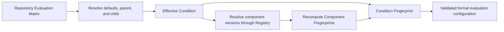

# Evaluation Matrix 与 Component Registry

本文说明 DevAgentOps 当前已经实现的正式评测配置规则，对应：

- Issue #4：Evaluation Matrix；
- Issue #5：Component Registry。

它们解决的是同一类可复现问题的两个层次：

| 层次 | 要回答的问题 | 当前实现 |
|------|--------------|----------|
| Evaluation Matrix | 一次实验实际使用了什么配置？ | 解析完整 Effective Condition，并计算 Condition Fingerprint |
| Component Registry | 配置中引用的组件版本是否仍代表原来的行为内容？ | 冻结 Component Manifest，并校验 Component Fingerprint |

因此，Issue #5 不只是增加了一个组件管理工具。它补上了正式评测配置的第二层身份校验：Issue #4 防止 Condition ID 背后的实验配置静默变化，Issue #5 防止 Component Version 背后的 Prompt、Tool、Retriever 或 Policy 行为静默变化。

## 完整校验链



这条链当前只验证配置，不执行 Agent、模型或 Scorer。通过校验意味着“这份配置具有稳定、可检查的身份”，不意味着正式评测运行已经发生。

## 1. Evaluation Matrix 规则

Evaluation Matrix 是仓库管理的正式实验设计文件。它不是任意运行参数列表，而是一组经过控制的比较条件。

### 1.1 Matrix 顶层字段

Matrix 只接受以下顶层字段：

| 字段 | 是否必需 | 含义 |
|------|----------|------|
| `matrix_id` | 是 | Matrix 的稳定名称 |
| `matrix_version` | 是 | 当前实验设计版本 |
| `schema_version` | 是 | Matrix 文件格式版本；当前 loader 会记录该值，但尚未限制具体支持值 |
| `defaults` | 否 | 所有 Condition 共享的默认配置 |
| `conditions` | 是 | Condition 列表 |

未知顶层字段会被拒绝，避免拼写错误悄悄进入实验配置。

### 1.2 Condition 字段

每个 Condition 可以声明：

- `id`：Condition 名称，Matrix 内必须唯一；
- `extends`：可选的父 Condition；
- `type`：`anchor`、`ablation` 或 `candidate`；
- `runtime_variant`；
- `suite`；
- `evaluation_method`；
- `model`；
- `components`；
- `budgets`；
- `repeats`。

解析完成后的 Effective Condition 必须包含除 `id` 和 `extends` 以外的八个配置字段。Condition 类型目前只参与枚举校验；不同类型的更高层发布或排行榜策略尚未由 loader 执行。

三类 Condition 的设计意图是：

| 类型 | 用途 |
|------|------|
| `anchor` | 稳定参照条件，用于解释方法、Suite 或 Runtime 变化后的结果移动 |
| `ablation` | 相对参照条件只改变一个主要变量，帮助定位能力来源 |
| `candidate` | 产品相关的完整候选配置 |

V1 使用受控条件集合，不生成所有 Runtime、Model、Retriever、Tool 和 Prompt 的笛卡尔积。

### 1.3 Defaults 与一层继承

Effective Condition 的解析优先级是：

```text
defaults < parent condition < child condition
```

后面的值覆盖前面的值。嵌套对象递归合并，例如 Child 可以只覆盖 `budgets.max_steps`，同时继承其他 Budget 字段。

V1 只允许一层 `extends`：

```text
child -> parent        允许
grandchild -> child -> parent    拒绝
```

同时拒绝：

- 不存在的父 Condition；
- Condition 继承循环；
- 重复的 Condition ID；
- 未知字段；
- 不支持的 Condition Type；
- 解析后仍缺失的必需字段。

`id` 和 `extends` 是命名与配置复用机制，不进入 Effective Condition。

### 1.4 Matrix 示例

```json
{
  "matrix_id": "triage-v1",
  "matrix_version": "1",
  "schema_version": "1",
  "defaults": {
    "suite": "triage-suite-v1",
    "evaluation_method": "triage-method-v1",
    "model": {
      "provider": "openai-compatible",
      "name": "test-model",
      "temperature": 0
    },
    "components": {
      "prompt": "triage-prompt-v1",
      "tool_registry": "triage-tools-v1",
      "retriever": "none-v1",
      "tool_policy": "read-only-v1",
      "mcp_server_set": "none-v1",
      "skill_registry": "none-v1"
    },
    "budgets": {
      "max_steps": 8,
      "max_tokens": 4096
    },
    "repeats": 1
  },
  "conditions": [
    {
      "id": "pipeline-anchor-v1",
      "type": "anchor",
      "runtime_variant": "pipeline"
    },
    {
      "id": "react-retrieval-ablation-v1",
      "extends": "pipeline-anchor-v1",
      "type": "ablation",
      "runtime_variant": "react",
      "components": {
        "retriever": "hybrid-v1"
      }
    }
  ]
}
```

示例中的 Component Version 必须先存在于 Registry，才能通过正式校验。仓库当前的 `components/registry.json` 是空的初始结构，不预先声明这些示例版本。

### 1.5 Effective Condition 与 Condition Fingerprint

Loader 会先解析完整 Effective Condition，再把规范化 JSON 做 SHA-256：

- JSON Key 顺序和缩进不影响 Fingerprint；
- Defaults 或 Parent 中继承来的值会进入 Fingerprint；
- `condition_id`、`extends`、Matrix 排版不进入 Fingerprint；
- 两个不同 ID 如果解析成相同 Effective Condition，会得到相同的结构 Fingerprint。

在正式 Registry 校验模式下，已验证的 Component Fingerprint 也会进入 Condition Fingerprint 输入。因此，同一个 Component Version 如果指向不同的行为内容，不可能继续产生可信的相同 Condition 身份。

## 2. Component Registry 规则

Matrix 中的 `components` 只保存人类可读的 Version，例如 `triage-prompt-v1`。Version 本身只是标签；如果文件内容可以在不改 Version 的情况下变化，Matrix 仍然不可复现。

Component Registry 为这个标签增加内容身份：

```text
Component Type + Component Version
    -> Frozen Manifest Path
    -> Component Fingerprint
```

### 2.1 六类组件

V1 支持以下 Component Type：

| Component Type | 必需 Behavior 字段 | 可选 Behavior 字段 |
|----------------|---------------------|---------------------|
| `prompt` | `template` | `variables` |
| `tool_registry` | `tools` | 无 |
| `retriever_config` | `strategy`、`settings` | 无 |
| `tool_policy` | `rules` | `default_action` |
| `mcp_server_set` | `servers` | 无 |
| `skill_registry` | `skills` | 无 |

未知 Behavior 字段会被拒绝。`tools`、`rules`、`servers` 和 `skills` 必须是对象列表；空列表可以诚实表达 V1 尚未实现的 MCP 或 Skill 能力。

Model Configuration 不属于 Component Registry。它独立保存在 Matrix 和未来的 Run Manifest 中，因为 Model 不是仓库内可冻结的行为组件文件。

### 2.2 Manifest Envelope

Schema Version 1 Manifest 使用严格结构：

```json
{
  "schema_version": "1",
  "component_type": "prompt",
  "component_version": "draft",
  "behavior": {
    "template": "Diagnose the failure using evidence from {log}.",
    "variables": ["log"]
  },
  "metadata": {
    "author": "example",
    "notes": "Review context only."
  }
}
```

字段规则：

- 必需：`schema_version`、`component_type`、`behavior`；
- 可选：`component_version`、`metadata`；
- 未知顶层字段拒绝；
- 当前只接受 Manifest `schema_version: "1"`；
- Draft 可以省略 `component_version`，或使用 Draft 名称；
- 所有行为相关配置必须放在 `behavior`；
- 作者、说明、时间等审阅信息放在 `metadata`。

### 2.3 Component Fingerprint

Schema Version 1 只对规范化后的 `behavior` 对象做 SHA-256：

```text
fingerprint = SHA256(canonical_json(manifest.behavior))
```

因此：

- 修改缩进或 Key 顺序不会改变 Fingerprint；
- 修改 `metadata` 不会改变 Fingerprint；
- 修改任何 Behavior 字段都会改变 Fingerprint；
- Component Type 和 Version 由 Registry 索引与 Manifest 字段另行校验，不混入 Behavior Hash。

这个边界要求作者正确分类字段。把真正影响行为的配置错误地放入 `metadata`，会让变更逃离 Fingerprint；Manifest Schema 的目的之一就是让这种分类可以审查。

### 2.4 Draft、Validate 与 Freeze

Draft Manifest 可以在本地自由修改，但不能进入正式 Matrix 比较。工作流是：

```text
edit draft
  -> component validate
  -> local review or experimentation
  -> component freeze with a new version
  -> update Matrix reference
  -> formal eval doctor
```

Validate 只检查 Manifest 并输出当前 Fingerprint：

```bash
devagentops component validate \
  --manifest components/drafts/prompt.json
```

Freeze 会：

1. 校验 Manifest Schema 与 Component Type；
2. 计算 Canonical Component Fingerprint；
3. 把 Manifest 写入 `components/frozen/<type>/<version>.json`；
4. 把 Manifest Path、Fingerprint、`frozen_at` 和 Metadata 写入 Registry；
5. 把请求的 Version 写入 Frozen Manifest。

```bash
devagentops component freeze \
  --manifest components/drafts/prompt.json \
  --registry components/registry.json \
  --version triage-prompt-v1
```

同一 Version、同一 Behavior 的重复 Freeze 是幂等的。同一 Type 和 Version 如果对应不同 Behavior，则必须创建新 Version；系统会拒绝覆盖，这种冲突称为 Version Pollution。

### 2.5 Registry Record

Registry 按 Component Type 和 Version 组织，只记录 Frozen Component：

```json
{
  "schema_version": "1",
  "components": {
    "prompt": {
      "triage-prompt-v1": {
        "manifest": "frozen/prompt/triage-prompt-v1.json",
        "fingerprint": "<64-character sha256>",
        "frozen_at": "2026-08-05T00:00:00Z",
        "metadata": {
          "notes": "Reviewed V1 prompt"
        }
      }
    }
  }
}
```

Manifest Path 必须位于 Registry 目录内。正式校验不会只相信 Registry 中保存的 Fingerprint，而会重新读取 Manifest、重新计算 Fingerprint，再与记录比较。

## 3. Matrix 与 Registry 的连接规则

Matrix Component Key 与 Registry Component Type 的映射是：

| Matrix Key | Registry Type | 说明 |
|------------|---------------|------|
| `prompt` | `prompt` | 直接映射 |
| `tool_registry` | `tool_registry` | 直接映射 |
| `retriever` | `retriever_config` | Issue #4 兼容名称 |
| `retriever_config` | `retriever_config` | 规范名称 |
| `tool_policy` | `tool_policy` | 直接映射 |
| `mcp_server_set` | `mcp_server_set` | 直接映射 |
| `skill_registry` | `skill_registry` | 直接映射 |

同一个 Condition 不能同时声明 `retriever` 和 `retriever_config`，因为它们代表同一组件类型，会产生歧义。

正式校验会拒绝：

- Draft Version；
- Registry 中不存在的 Version；
- 不支持的 Component Key；
- 同一 Component Type 的别名冲突；
- Registry Record 缺字段或字段类型错误；
- Manifest Path 逃出 Registry 目录；
- Registry Type 与 Manifest Type 不一致；
- Registry Version 与 Manifest Version 不一致；
- 保存的 Fingerprint 与重新计算的 Fingerprint 不一致。

## 4. Eval Doctor 的两个模式

`eval doctor` 当前必须显式选择模式：

| 命令 | 用途 | Component 校验 | Condition Fingerprint 输入 |
|------|------|----------------|-----------------------------|
| `eval doctor --structural-only --matrix ...` | Issue #4 的非正式结构检查 | 不执行 | Effective Condition |
| `eval doctor --matrix ... --registry ...` | Issue #4 + #5 的正式组件完整性检查 | 执行 | Effective Condition + Component Fingerprints |

正式模式：

```bash
devagentops eval doctor \
  --matrix path/to/evaluation-matrix.json \
  --registry components/registry.json
```

`--structural-only` 与 `--registry` 不能同时使用。省略两者也会失败，避免调用者无意中跳过组件完整性校验。

## 5. 变更时应遵守的规则

| 变更 | 正确做法 | 身份结果 |
|------|----------|----------|
| 只改 Matrix 排版 | 不需要新 Component Version | Fingerprint 不变 |
| 只改 Component Metadata | 可以保留 Version | Component Fingerprint 不变 |
| 改 Prompt、Tool、Retriever 或 Policy Behavior | Freeze 新 Component Version，并更新 Matrix | Component 与 Condition Fingerprint 改变 |
| 改 Runtime、Model、Budget、Repeat、Suite 或 Method 引用 | 更新 Matrix Condition | Condition Fingerprint 改变 |
| 修改已冻结 Manifest 的 Behavior | 禁止 | Formal Doctor 报 Version Pollution |
| 同一 Effective Condition 仅改 Condition ID | 不改变实验内容身份 | Fingerprint 不变 |

Condition Fingerprint 负责说明“实际实验配置是否变化”，Condition ID 和 Component Version 负责提供人类可读的名称。名称不能代替内容身份。

## 6. 当前边界

当前已经实现：

- Matrix JSON 字段校验；
- Defaults 与一层 `extends` 解析；
- Effective Condition 输出；
- 结构与正式 Condition Fingerprint；
- 六类 Component Manifest 校验；
- Component Validate、Freeze 与 Registry 写入；
- Draft、Missing、Alias 和 Version Pollution 检测；
- 正式 Doctor 输出 Component Fingerprints。

当前尚未实现：

- Agent 或模型调用；
- Formal Evaluation Runner；
- Suite 与 Case Artifact 的完整 Preflight；
- Run Manifest 持久化；
- Scorer、Metric、Quality Gate、Leaderboard 和 Badcase；
- ADR 0113 中 Leaderboard 分区与重跑规则的运行时执行；
- 真实 MCP Server 或完整 Skill Packaging。

所以，当前 `eval doctor --registry` 是“Matrix + Component 完整性检查”，还不是 PRD 中未来覆盖 Suite、Case、Leakage 和 Model Completeness 的完整 Formal Eval Doctor。

## 7. 相关来源

- [ADR 0113: Evaluation Comparison Model](../adr/0113-evaluation-comparison-model.md)
- [ADR 0114: Component Versioning and Run Manifests](../adr/0114-component-versioning-and-run-manifests.md)
- [V1 PRD](../prd/devagentops-v1-agentops-evaluation-baseline.md)
- [Component Manifest 与命令参考](../../components/README.md)
- 实现：`src/devagentops/evaluation_matrix.py`、`src/devagentops/component_registry.py`、`src/devagentops/cli.py`
- 契约测试：`tests/test_issue_4_evaluation_matrix.py`、`tests/test_issue_5_component_registry.py`
