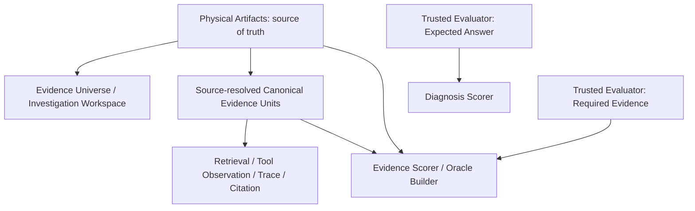

# Formal Evaluation Methodology：Evidence Universe、Schema V2 与 Access Conditions

本文定义 DevAgentOps Formal Evaluation 中 Case 世界、证据坐标、Trusted Evaluator 边界和 Runtime 访问方式。它解决两个相连的问题：

1. Curator 不得在评测前把 Normal Agent corpus 裁成 minimal required evidence；
2. Physical Investigation Workspace 不得与 Canonical Evidence coordinates 或 Evaluator Ground Truth 混为同一份 Artifact。

本方法论与 Schema V2 三层设计已经接受，Schema V2 Loader、Fingerprint、Doctor、Scorer split 和 public leakage boundary 已实现。Runtime、Retriever、Tool、Index 与 Oracle Runner 仍未实现。Issue #15 下一步先重建 B04 V2 并完成 Human Review；Issue #22 不修改其现有 drafts。

## 1. 证据与信任模型



### 1.1 Evidence Universe

Evidence Universe 是一个 Formal Case 中真实存在、可被调查的信息空间。第一版 Formal Suite 的 Case Universe 严格等于：

```text
complete or naturally bounded historical CI/test log
+
bounded repository snapshot derived from the exact failing/relevant revision
```

它必须 authentic、frozen、offline、bounded but realistic，并保留自然邻近信息与 natural distractors。不能因为 Curator 已知答案就只保留 root-cause 附近内容，也不能为制造难度添加 synthetic irrelevant noise。

Universe 不要求整个 upstream repository 或无界 log history。合理 repository 边界可以是相关 module/subtree，以及其中完整的 source、config、test、dependency 和 build files。Exact revision 固定来源身份与因果上下文，但不要求 Case 中冻结的 bytes 必须与 upstream commit bytes 完全相同：必要时可以先执行 Human-reviewed、semantics-preserving sanitization，前提是不改变 failure causal semantics。

Project Knowledge 仍是 DevAgentOps 的一般 Runtime 能力，但不是 Issue #15 Formal Case 的 Physical Artifact，也不属于当前 Schema V2 Evidence Universe。未来可把 versioned Project Knowledge 作为独立 retrieval/runtime input 或 ablation，不在本设计中加入 Case。

### 1.2 Investigation Workspace

Investigation Workspace 是 Evidence Acquisition Condition 提供给 Runtime 的 Evidence Universe 视图。Normal ReAct 概念上通过工具调查：

```text
physical-artifacts/raw.log
physical-artifacts/repository/*
```

例如：

- `search_log`；
- `open_log_range`；
- `list_files`；
- `search_repo`；
- `open_file`。

Workspace 不是一次性 Prompt Context。ReAct 不应在 episode start 获得完整 Canonical Evidence list、Required Evidence IDs 或 Expected Answer。

### 1.3 Canonical Evidence Unit

Canonical Evidence Unit 是对 Physical Artifact 中 source span 的确定性稳定坐标。它服务于 retrieval indexing、tool-result identity、trace observation、report citation、Retrieval Evidence Hit、Report Evidence Hit 和 Oracle resolution。

Physical Artifact 是唯一事实源；Canonical Unit 不能成为一份可独立漂移的事实副本。每个 unit 至少需要：

- stable、answer-neutral `evidence_id`；
- controlled physical source path；
- machine-readable source span；
- resolved content SHA-256；
- deterministic、source-faithful resolution。

示例方向：

```json
{
  "evidence_id": "log:ci-lines-0572-0601",
  "source": "physical-artifacts/raw.log",
  "start_line": 572,
  "end_line": 601,
  "content_sha256": "<sha256>"
}
```

```json
{
  "evidence_id": "repo:equals-avoid-null-check.java:lines-0401-0500",
  "source": "physical-artifacts/repository/src/main/EqualsAvoidNullCheck.java",
  "start_line": 401,
  "end_line": 500,
  "content_sha256": "<sha256>"
}
```

ID 描述来源或位置，不得编码 Failure Type、Root Cause 或 Fix。Formal Methodology 不规定统一 chunk size、unit count、repository file count、noise ratio 或 line-window size。

### 1.4 Required Evidence 与 Expected Answer

Schema V2 把两类 Ground Truth 分离：

- `evaluator/required-evidence.json` 是唯一 Evidence Ground Truth，保存 Required/Optional Canonical Evidence IDs；
- `evaluator/expected-answer.json` 是 Diagnosis Ground Truth，保存 Primary/Acceptable Failure Type、Expected Summary、Expected Root Cause 和 Recommended Action 等诊断契约。

Required Evidence 是 Human-reviewed、hidden、inclusion-minimal sufficient subset。完整集合包含推导 Expected Diagnosis 所需的来源事实；移除任一项后，至少一个必要事实或消歧依据不可用。Canonical content 不得写入 evaluator-authored answer、scorer label、selection rationale 或 curator reasoning。

通常应满足：

```text
Normal Investigation Workspace >> Hidden Required Evidence subset
```

不要创建第二份 `oracle-evidence.json`。Required Evidence 只有一个 source of truth。

## 2. Offline Case Schema V2 三层目录

已实现的严格布局如下，三层语义不得合并：

```text
<case-id>/
├── case.json
├── physical-artifacts/
│   ├── raw.log
│   ├── repository-manifest.json
│   └── repository/
│       ├── src/...
│       ├── test/...
│       └── config/...
├── canonical-evidence/
│   ├── log-units.json
│   └── repository-units.json
└── evaluator/
    ├── required-evidence.json
    └── expected-answer.json
```

### 2.1 Physical Artifacts

`physical-artifacts/raw.log` 保存 complete or naturally bounded frozen failure log。`physical-artifacts/repository/` 保存来源于 exact failing/relevant upstream revision 的 bounded repository files，并保留真实相对路径。若源 artifact 含 credential、token、private identifier 或其他不允许的数据，可以在进入 Case 前进行 Human-reviewed、semantics-preserving sanitization；sanitization 不得改变 failure causal semantics。

```text
upstream exact revision
        -> if necessary: Human-reviewed semantics-preserving sanitization
        -> frozen Physical Artifact in Case Package
        -> Canonical Evidence source spans / hashes
        -> Case fingerprint
```

Agent/Runtime 实际调查的是 Case Package 中冻结后的 Physical Artifact，而不是重新读取 upstream revision。

`repository-manifest.json` 的职责是：

- 明确 snapshot membership；
- 记录真实 upstream repository identity 与 exact revision identity；
- 记录每个冻结文件在允许的 sanitization 之后的 path、SHA-256 与 byte size；
- 配合 provenance/sanitization metadata 记录发生了哪些允许的转换及其 Human review 状态；
- 进入 deterministic Case fingerprint coverage。

Loader 必须按 Manifest 验证 membership 和冻结后的 content，不得通过目录扫描静默决定 Formal Snapshot 包含哪些文件。Manifest 的 exact revision 字段证明来源，不要求 sanitized frozen artifact 与 upstream commit 逐字节相同。

### 2.2 Canonical Evidence

`canonical-evidence/log-units.json` 与 `repository-units.json` 引用 Case 中冻结后的 Physical Artifact path + source span + resolved content hash；source span 与 `content_sha256` 都针对 sanitization 后的 frozen artifact 计算。Runtime 可以在 Agent 实际检查 physical span 后，把 observation 映射到 overlapping Canonical Evidence IDs，并将这些 IDs 附到 Tool Result/Trace，供最终报告引用。

```text
Agent investigates physical world
-> Runtime maps observation to canonical coordinates
-> Report cites canonical coordinates
-> Evaluator compares against hidden required evidence
```

Canonical unit 文件不是 Normal ReAct 的 episode-start evidence menu。

### 2.3 Trusted Evaluator Artifacts

整个 `evaluator/` 目录属于 Trusted Evaluator boundary。Normal Pipeline/Retrieval/ReAct model 不得直接读取它。Directory layout 是强物理约定；真正可见性仍由 Evidence Acquisition Condition 和 Runtime 强制执行并进入 fingerprint。

`required-evidence.json` 同时服务 Retrieval Evidence Hit、Report Evidence Hit、Oracle construction 和 Human evidence review。`expected-answer.json` 只服务 diagnosis ground truth 与 Scorer。

## 3. Runtime Visibility Matrix

| Artifact | ReAct model | Retrieval internals | Oracle builder | Trusted Evaluator |
| --- | --- | --- | --- | --- |
| `physical-artifacts/*` | through allowed tools | may read as configured | yes | yes |
| `canonical-evidence/*` | not exposed as complete list at episode start | may index/use internally | yes | yes |
| `evaluator/required-evidence.json` | no | no | yes | yes |
| `evaluator/expected-answer.json` | no | no | no | yes |

Not every runtime gets identical access. Whether a condition has fixed selection, retrieval, search/open tools, or an adaptive loop is an experimental variable, not a Case-construction responsibility.

## 4. Evidence Acquisition Conditions

所有受控条件尽量固定 same Case、same Physical Evidence Universe、same Expected Answer、same scorer，以及 Agent/System ablation 使用的 same base model。主要差异是 evidence acquisition 与 runtime scaffold。

| Condition | Evidence access | 自主调查 | 主要问题 |
| --- | --- | --- | --- |
| Fixed Pipeline | frozen deterministic acquisition/selection；可按实现读取 Physical Artifacts 或 Canonical Units | 否 | 固定流程能兑现多少诊断能力？ |
| Retrieval | index/query Canonical Units，向模型返回 selected units/content；不提供整个 corpus | 否；只有 static retrieval augmentation | Retrieval 本身带来多少 uplift？ |
| ReAct Agent | 通过 search/open/list 工具 adaptive multi-step 调查 Physical Investigation Workspace | 是 | 自主 investigation 是否提供额外价值？ |
| Oracle Evidence | Trusted Builder 直接解析 Required Evidence，绕过 normal discovery | 否；这是 diagnostic intervention | 关键证据已知时，固定模型能否完成诊断？ |

当前 Matrix Schema 尚无可执行的通用 Evidence Acquisition/Delivery 字段。这些语义是未来 Condition 与 Run Manifest 必须显式 version 和 fingerprint 的 accepted design；Offline Case Schema V2 已实现，但四种 Runtime Condition 尚未实现。

## 5. Oracle Evidence 是 Derived Runtime Input

Case 中不永久保存 pre-materialized Oracle content pack。Oracle Builder 执行：

```text
evaluator/required-evidence.json
        -> canonical-evidence/*
        -> physical-artifacts/*
        -> deterministic Oracle Pack Builder output
        -> fixed model
```

Oracle model 可以看到 resolved source-faithful content 与 normal Stable Evidence IDs，但不能看到：

- `required`/`optional` 标签或 `required-evidence.json`；
- `expected-answer.json`；
- Failure Type、Summary、Root Cause 或 Recommended Action ground truth；
- scorer label、curator reasoning 或 selection rationale。

## 6. Retrieval Evidence Hit 与 Report Evidence Hit

| Signal | 命中条件 | 回答的问题 |
| --- | --- | --- |
| Retrieval Evidence Hit | Run Trace 证明 Runtime/Agent 实际 retrieved 或 inspected Required Canonical Unit | 找到了吗？ |
| Report Evidence Hit | 最终 Structured Triage Report 合法引用 Required Canonical Unit | 报告使用了吗？ |

这可以区分没找到、找到但未使用、找到并引用。当前代码已让 `report_evidence_hit_rate` 从 V2 `EvidenceGroundTruth.required_evidence_ids` 读取分母，评分公式保持不变；Retrieval Evidence Hit 尚未实现。

## 7. 条件结果解释

| 对比结果 | 优先解释与检查 |
| --- | --- |
| Oracle PASS + ReAct FAIL | 模型在关键证据已知时能诊断，但 Agent/System 没有成功获得、管理或使用证据；检查 retrieval、tool use、context、planning、report synthesis 与 stopping。 |
| Retrieval FAIL + ReAct PASS | static/top-k retrieval 不足，多步 adaptive investigation 提供了额外价值。 |
| Pipeline FAIL + Retrieval PASS | 主要 uplift 来自 retrieval；不能据此把提升必然归因于 Agent loop。 |
| Oracle FAIL | 先审计 Oracle evidence completeness/minimality、prompt、report contract、scorer、truncation 与 variance；成立后才视为可能的 model reasoning bottleneck。 |

目标不是预设 ReAct 一定优于 Pipeline，而是测量 `Pipeline -> Retrieval -> ReAct -> Improved Agent` 每一步产生多少 uplift，以及 uplift 来自哪里。完整 Oracle Pairing 与 Realization Gap 解释见 [Oracle Evidence Diagnostic Condition 与 Agent-System Realization Gap](oracle-evidence-diagnostic-condition.md)。

## 8. Schema V2 与 Issue #15

Offline Case Loader 现在只支持 Schema V2。Schema V1 已有意识地退役，不保留 backward-compatible loader、mixed-schema Suite 或 migration framework；tiny fixture 已迁移到 V2。V2 把 repository Physical Artifact 与 Canonical Repository Evidence 分开，并把 Required Evidence 从 Diagnosis Ground Truth 中拆出。

Issue #15 的后续顺序保持：

- 当前 5 个 Batch-1 Schema V1 Packages 只作为 calibration drafts；
- 不 Human-freeze 这些 V1 Packages；
- 不按 V1 继续构造剩余 15 个 Packages；
- 先用 V2 重建 B04 作为 calibration Case；
- B04 的 V2 construction/review 通过后，再扩展到其余 Cases。

Issue #22 不修改任何 Issue #15 Package；现有五个 V1 drafts 根据既有 research/provenance/root-cause knowledge 重新构建，而不是自动转换。

## 9. V2 Formal Case Review Checklist

- Physical log/repository Universe 是否 authentic、frozen、offline、bounded but realistic？
- Repository Manifest 是否同时固定真实 upstream repository/revision identity，以及 frozen artifact 的 membership、path、size 与 file hash？
- 如有 sanitization，metadata 是否记录允许的转换与 Human review，且没有改变 failure causal semantics？
- Physical content 是否保留自然邻近信息且无 synthetic irrelevant noise？
- Canonical Units 是否 deterministic、source-faithful、answer-neutral，并能解析到受控 source span？
- Resolved content hash 是否与 Case 中冻结后的 Physical Artifact 一致？
- `required-evidence.json` 是否是唯一 Evidence Ground Truth，且 hidden/minimal sufficient？
- `expected-answer.json` 是否只保存 Diagnosis Ground Truth？
- Visibility Condition 是否阻止 Normal Runtime 读取 `evaluator/`？
- Normal Workspace 是否明显大于 Required Evidence subset？
- Case、Provenance、Sanitization、Reviewer 与完整 Fingerprint Chain 是否一起冻结？

## 10. 相关决策

- [ADR 0115: Evaluation Suite and Case Artifacts](../adr/0115-evaluation-suite-and-case-artifacts.md)
- [ADR 0118: Retrieval Corpus and Evidence Scope](../adr/0118-retrieval-corpus-and-evidence-scope.md)
- [ADR 0122: Structured Report and Evidence Contract](../adr/0122-structured-report-and-evidence-contract.md)
- [ADR 0124: Oracle Evidence Diagnostic Condition](../adr/0124-oracle-evidence-diagnostic-condition.md)
- [ADR 0125: Formal Evaluation Evidence Universe and Access](../adr/0125-formal-evaluation-evidence-universe-and-access.md)
- [ADR 0126: Offline Case Schema V2 Physical Artifacts and Canonical Evidence](../adr/0126-offline-case-schema-v2-physical-artifacts-and-canonical-evidence.md)
- [Structured Triage Report 校验与单 Case 确定性评分](structured-triage-report-and-per-case-scoring.md)
- [V1 Failure Type Taxonomy 与 Offline Case Policy](v1-failure-type-taxonomy-and-case-policy.md)
