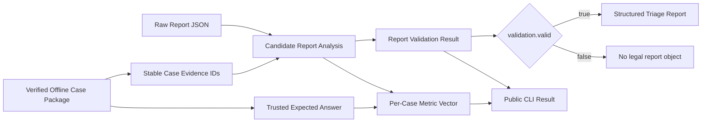

# Structured Triage Report 校验与单 Case 确定性评分

本文说明 DevAgentOps 当前已经实现的 Structured Triage Report Schema V1、候选报告校验和单 Case 确定性评分，对应 Issue #14。

这一实现建立了第一个从离线 Case 到质量指标向量的完整评分切片：

| 层次 | 要回答的问题 | 当前实现 |
|------|--------------|----------|
| Structured Triage Report Schema V1 | Agent 输出是否具有可检查的固定结构？ | 校验版本、Case 绑定、分类、必填内容、置信度、行动建议和 Evidence Reference |
| Report Validation Result | 非法 Agent 输出具体违反了哪些报告契约？ | 返回稳定、结构化且顺序确定的错误对象，不因报告质量问题中断评分 |
| Expected Answer | 当前 Case 的人工审核评分标签是什么？ | 保存 Primary/Acceptable Failure Type 与 Required/Optional Evidence，且只存在于可信 Evaluator 侧 |
| Per-Case Scorer | 当前报告在分类、证据和完整性维度表现如何？ | 输出四项单 Case Quality Metric，不合成为单一总分 |

本切片覆盖 PRD User Story 33–35、37–38，并开始 User Story 39。它不实现 Retrieval Evidence Hit、Tool Path Validity、Suite 聚合、Quality Gate、Leaderboard 或 Badcase。

## 完整校验与评分链



这里必须区分两个概念：

- Candidate Report 可以是任意合法 JSON；它可能缺字段、字段非法或引用不存在的 Evidence；
- Structured Triage Report 只表示已经通过完整 Schema V1 校验的合法报告对象。

因此，validator 不会先强制构造合法报告再捕获异常，而是先从 Raw JSON 逐项提取可解析字段，生成 `ReportValidationResult`，计算仍然有诊断意义的指标，最后只在 `validation.valid=true` 时构造 `StructuredTriageReport`。

## 1. 信任边界

Issue #14 的评分链分为被测 Agent 侧和可信 Evaluator 侧：

| 边界 | 可以访问 | 不可以访问 |
|------|----------|------------|
| Evaluated Agent | Case 输入、允许的 Evidence、报告 Schema、可用工具 | Expected Answer、Scorer 内部标签、Required/Optional Evidence 集合 |
| Trusted Evaluator | Candidate Report、Case Package、Expected Answer、Scorer | 不应把评分标签重新注入 Agent 的 Prompt、Tool、Retriever 或 Project Knowledge |

上表描述普通 Agent Condition。未来 Oracle Evidence Diagnostic Condition 是一个显式、版本化的 Evidence Delivery 例外：Trusted Evaluator 可以在边界内用 `required_evidence_ids` 选择来源 Evidence，但模型侧只能接收对应的 Frozen Evidence Content 与正常 Stable Evidence ID，不能接收 Required/Optional 标签、Expected Answer、答案文本、Scorer Label 或 Curator Reasoning。该例外不改变普通 Agent、公共 CLI 或 Scorer Output 的信任边界。

Expected Answer 和确定性 Scorer 只能存在于可信 Evaluator 侧。以下公共边界不得泄露评分标签：

- `OfflineCasePackage.as_dict()`；
- `eval doctor`；
- `eval score`；
- Validation Error；
- Evidence Diagnostics。

公开 Evidence Diagnostics 只包含计数，不包含 Required/Optional Evidence ID 集合，也不包含未命中的具体 Required Evidence ID。

## 2. Structured Triage Report Schema V1

报告 Schema 是产品与评测契约，不是可调 Agent Component，因此不会进入 Component Registry。

Schema V1 只接受以下顶层字段：

| 字段 | 是否必需 | 最低内容 | 校验语义 |
|------|----------|----------|----------|
| `schema_version` | 是 | 非空字符串 | 当前只支持 `"1"` |
| `case_id` | 是 | 非空字符串 | 必须等于被评分 Case 的 `case_id` |
| `classification_status` | 是 | 非空字符串 | `classified` 或 `inconclusive` |
| `failure_type` | 条件必需 | Classified 时为非空字符串 | 必须满足 V1 Failure Type 条件规则 |
| `summary` | 是 | 非空字符串 | 对可观察失败的简要说明 |
| `root_cause` | 是 | 非空字符串 | 对根因的诊断说明 |
| `recommended_action` | 是 | 非空字符串 | 必须满足 V1 最低结构特异性代理 |
| `confidence` | 是 | 非布尔数值 | 必须是有限数值且位于 `[0, 1]` |
| `evidence_references` | 是 | 非空列表 | 每项必须是只含稳定 `evidence_id` 的对象 |

未知顶层字段会使报告 validation 失败，避免拼写错误或未版本化扩展静默进入评分。

### 2.1 合法报告示例

```json
{
  "schema_version": "1",
  "case_id": "constructed-assertion-001",
  "classification_status": "classified",
  "failure_type": "test_assertion_failure",
  "summary": "The calculation result contradicts the asserted total.",
  "root_cause": "The implementation multiplies values instead of adding them.",
  "recommended_action": "Review calculate_total and restore the required addition behavior.",
  "confidence": 0.95,
  "evidence_references": [
    {"evidence_id": "log:assertion-mismatch"},
    {"evidence_id": "repo:calculate-total"}
  ]
}
```

### 2.2 Failure Type 与 Inconclusive

`classified` 报告必须选择五类 V1 Failure Type 之一：

- `test_assertion_failure`；
- `lint_or_type_failure`；
- `dependency_or_install_failure`；
- `config_or_environment_failure`；
- `timeout_or_flaky_failure`。

`UNKNOWN` 不是 Failure Type。当证据不足时，报告使用：

```json
{
  "classification_status": "inconclusive",
  "failure_type": null
}
```

合法 Inconclusive 报告也可以省略原始 JSON 中的 `failure_type`。构造合法 `StructuredTriageReport` 时会统一归一化为 `failure_type=None`。

以下组合会 validation 失败：

- `classified` 但 `failure_type` 缺失或为 `null`；
- `classified` 但 Failure Type 不属于 V1 Taxonomy；
- `inconclusive` 但仍选择了 Failure Type；
- Classification Status 不是 `classified` 或 `inconclusive`。

### 2.3 Recommended Action 最低规则

V1 使用公开常量：

```text
MIN_RECOMMENDED_ACTION_NON_WHITESPACE_CHARS = 12
```

validator 计算移除空白后的 Unicode 字符数。少于 12 个字符时返回 `recommended_action_too_short`。

这只是最低结构代理，用于拒绝 `fix it`、`修复它` 之类明显不足的内容。字符数不能证明行动建议在技术上正确，V1 也不声称执行语义质量判断。

### 2.4 Confidence 与极端 JSON 数字

Confidence 必须是非布尔、有限且位于 `[0, 1]` 的数值。

Report Loader 使用 `Decimal` 解析 JSON Number，先做有限性和范围比较，再把合法值归一化为 `float`。因此，一万位整数等合法 JSON 数字会产生稳定的 `confidence_out_of_range` Validation Error，不会因 `float()` 溢出而让 Scorer 崩溃。

超大数值不会原样复制进公开错误。错误中的 `actual` 使用可安全序列化的数量级描述，避免错误报告本身再次触发整数序列化限制。

## 3. Evidence Reference

Schema V1 的 Evidence Reference 只允许：

```json
{"evidence_id": "log:assertion-mismatch"}
```

规则如下：

- Reference 必须是 JSON Object；
- 必须包含非空字符串 `evidence_id`；
- 不允许未知字段；
- ID 必须存在于当前 Offline Case Package 的稳定 Evidence ID 集合；
- 重复引用 validation 失败，但评分时按集合去重；
- 不存在的 ID 属于 hallucinated Evidence。

Expected Answer 将 Evidence 分成：

- `required_evidence_ids`：正式 Evidence Hit 的分母；
- `optional_evidence_ids`：可增强报告，但缺失时不扣分。

Optional Evidence 不进入正式分母。

## 4. Candidate Report Validation

### 4.1 基础设施失败与 Agent 报告失败

只有 Evaluator 无法开始工作时，CLI 才返回退出码 `2`：

- Case 文件不存在、不可读或 Case Package 无效；
- Case/Expected Answer/Fingerprint 损坏；
- Report 文件不存在或不可读；
- Report 不是合法 JSON。

只要 Report 是合法 JSON，报告契约错误都属于被评估的 Agent 输出质量问题，CLI 返回退出码 `0` 并继续输出：

```json
{
  "validation": {
    "valid": false,
    "errors": []
  },
  "quality_metrics": {},
  "evidence_diagnostics": {}
}
```

这包括：

- JSON 顶层不是 Object；
- 未知 Schema Version；
- 缺少必填字段；
- Failure Type 非法；
- Confidence 越界；
- Evidence ID 不存在；
- Case ID 不匹配。

### 4.2 结构化错误

每个 Validation Error 至少包含：

```json
{
  "code": "unknown_evidence_id",
  "field": "evidence_references[0].evidence_id",
  "actual": "fake:123",
  "message": "Evidence ID does not exist in the evaluated case"
}
```

字段语义：

| 字段 | 含义 |
|------|------|
| `code` | 稳定机器契约，可用于测试和 Dashboard 分类 |
| `field` | 报告中的定位路径 |
| `message` | 面向人类的说明，不作为机器判断依据 |
| `expected` | 按错误类型选择性提供的公开契约值 |
| `actual` | 按错误类型选择性提供的候选值或安全摘要 |

错误顺序固定为 Schema、Case、Classification、Summary、Root Cause、Recommended Action、Confidence、Evidence、未知顶层字段。Evidence 列表按索引顺序检查，未知字段按名称排序，因此相同输入会得到相同错误序列。

错误不得返回当前 Case 的 Primary Failure Type、Acceptable Failure Type、Required/Optional Evidence 集合或 Expected Answer 文本。

## 5. Required Fields Completeness

Completeness 只衡量最低内容是否填写，不重复判断值是否正确。

固定分母为八项：

| # | 内容组 | 算作已填写的条件 |
|---|--------|------------------|
| 1 | Schema Version | 非空字符串 |
| 2 | Case ID | 非空字符串 |
| 3 | Classification | Status 非空；Classified 还需非空 Failure Type；Inconclusive 不要求 Failure Type |
| 4 | Summary | 非空字符串 |
| 5 | Root Cause | 非空字符串 |
| 6 | Recommended Action | 非空字符串 |
| 7 | Confidence | 非布尔数值 |
| 8 | Evidence References | 非空列表 |

公式为：

```text
required_fields_completeness = filled_content_groups / 8
```

以下内容虽然 validation 失败，但在 Completeness 中仍算已填写：

- 未知 Schema Version；
- Case ID 不匹配；
- 非法但非空的 Failure Type；
- 越界 Confidence；
- 太短但非空的 Recommended Action；
- 包含 hallucinated ID 的非空 Evidence 列表。

## 6. 单 Case Quality Metric Vector

Scorer 输出：

```json
{
  "failure_type_exact_match": 1.0,
  "failure_type_reviewed_acceptable_match": 0.0,
  "report_evidence_hit_rate": 1.0,
  "required_fields_completeness": 1.0
}
```

单 Case 使用 `match`，不使用 `accuracy`。未来 Suite 聚合才能定义：

```text
failure_type_exact_accuracy = mean(failure_type_exact_match)
```

### 6.1 Exact 与 Reviewed Acceptable

两项指标严格互斥：

| Candidate Failure Type | Exact Match | Reviewed Acceptable Match |
|------------------------|-------------|---------------------------|
| 等于 `primary_failure_type` | `1.0` | `0.0` |
| 属于人工审核的 `acceptable_failure_types` | `0.0` | `1.0` |
| 其他、非法或 Inconclusive | `0.0` | `0.0` |

Expected Answer Loader 会拒绝 Primary Failure Type 同时出现在 Acceptable 列表中。

### 6.2 Report Evidence Hit Rate

正常公式为：

```text
unique cited required evidence / required evidence count
```

评分规则：

- 引用按集合去重，重复引用不会增加分子；
- Optional Evidence 不进入分母；
- 如果存在任一 unknown/hallucinated ID，正式 Evidence Hit 强制为 `0.0`；
- 如果 Case ID 不匹配，正式 Evidence Hit 强制为 `0.0`；
- Evidence 列表无法解析时为 `0.0`。

损坏但无法提取 ID 的 Evidence 条目会使 validation 失败，但不会覆盖其他合法引用的命中结果。例如 Required Evidence `A`、`B` 都被合法引用，同时列表中存在一个非 Object 条目时：

```text
validation.valid = false
report_evidence_hit_rate = 1.0
```

这是为了保留不同评分维度的诊断价值。只有 hallucinated ID 使用正式 Evidence 硬惩罚。

### 6.3 Case ID 绑定

报告必须满足：

```text
report.case_id == case_package.case_id
```

不匹配时返回 `case_id_mismatch`，并强制把三个依赖当前 Expected Answer 的指标设为 `0.0`：

- `failure_type_exact_match`；
- `failure_type_reviewed_acceptable_match`；
- `report_evidence_hit_rate`。

Completeness 仍根据报告自身最低内容独立计算。

## 7. Evidence Diagnostics

公开诊断只包含：

```json
{
  "required_evidence_count": 2,
  "matched_required_evidence_count": 1,
  "unknown_evidence_count": 1,
  "duplicate_evidence_reference_count": 0
}
```

`unknown_evidence_count` 表示不同 Unknown Evidence ID 的数量，不是未知引用出现次数。相同未知 ID 被引用两次时：

```text
unknown_evidence_count = 1
duplicate_evidence_reference_count = 1
```

Diagnostics 中的 matched count 只用于解释。只要 unknown count 大于零，正式 `report_evidence_hit_rate` 仍然是 `0.0`。

## 8. Expected Answer 与 Fingerprint

Expected Answer 在 Loader 内部表示为只读类型，包含：

- Schema Version；
- Primary Failure Type；
- Acceptable Failure Types；
- Required/Optional Evidence IDs；
- Summary、Root Cause、Recommended Action。

它挂在 `OfflineCasePackage` 上供可信 Scorer 使用，但不会进入 `OfflineCasePackage.as_dict()`。

类型化重构保持原有 Case Fingerprint 输入不变：Expected Answer 仍按原来的 JSON 字段和列表形式进入 Canonical Serialization。因此，只改变 Python 内部表示不会改变 Case Fingerprint；真正修改 Expected Answer 内容仍会改变 Case 和 Suite Fingerprint。

### 8.1 Required Evidence 的 Minimal Sufficient 原则

Case/Expected Answer 的 Human Review 应把 `required_evidence_ids` 视为 inclusion-minimal 的充分事实集合：整体包含固定诊断契约下推导 Expected Diagnosis 所需的来源事实；逐项移除会使至少一个必要事实或消歧依据不可用。它不表示“越短越好”，也不以某次模型 PASS 作为充分性的循环证明。

Required Evidence 必须引用 Frozen Log Chunk 或 Repository Evidence Snapshot 的 source-faithful 内容，不能由 Curator 改写为 Failure Type、Root Cause、Fix 或 Tool Path 结论。Expected Answer 的答案字段、Required/Optional 标签与 Reviewer 选择理由仍属于 Trusted Evaluator 数据。

当前 Loader 只校验 Required/Optional ID 的非空、去重、互斥和 Referential Integrity；“Minimal”“Sufficient”“不编码答案”仍是 Human Review 质量契约，尚无自动语义验证。

## 9. CLI 使用

命令格式：

```bash
devagentops eval score \
  --case tests/fixtures/evaluation/cases/constructed-assertion-001/case.json \
  --report path/to/report.json
```

合法报告返回：

```json
{
  "evidence_diagnostics": {
    "duplicate_evidence_reference_count": 0,
    "matched_required_evidence_count": 2,
    "required_evidence_count": 2,
    "unknown_evidence_count": 0
  },
  "quality_metrics": {
    "failure_type_exact_match": 1.0,
    "failure_type_reviewed_acceptable_match": 0.0,
    "report_evidence_hit_rate": 1.0,
    "required_fields_completeness": 1.0
  },
  "validation": {
    "errors": [],
    "valid": true
  }
}
```

CLI 输出不包含 Expected Answer，也不包含 Retrieval、Tool Path、Aggregation、Quality Gate、Leaderboard 或 Badcase 字段。

## 10. 当前边界

当前已经实现：

- Structured Triage Report Schema V1；
- 候选报告的逐项结构化校验；
- Stable Evidence ID 解析与 hallucination 检测；
- 单 Case Exact/Acceptable Classification Match；
- Required Evidence Citation Hit；
- Required Fields Completeness；
- Count-only Evidence Diagnostics；
- CLI 单 Case 评分边界。

当前尚未实现：

- Retrieval Evidence Hit；
- Tool Path Validity；
- 多 Case/Suite 指标聚合；
- Per-Failure-Type Breakdown；
- Quality Gate；
- Leaderboard；
- Badcase 生成和审阅；
- Agent Runtime、模型调用或真实 CI 执行；
- Oracle Evidence Pack、配对运行或 Agent-System Realization Gap；
- 自动修复、代码修改或 CI 重跑。

通过 `eval score` 只表示“这个候选报告已经按当前 Case 的冻结评分契约产生了确定性结果”，不表示完整 Formal Evaluation Run 已经执行。

## 11. 相关来源与实现

领域与决策来源：

- `CONTEXT.md`；
- `docs/prd/devagentops-v1-agentops-evaluation-baseline.md`；
- `docs/adr/0115-evaluation-suite-and-case-artifacts.md`；
- `docs/adr/0116-metrics-quality-gate-and-leaderboard.md`；
- `docs/adr/0122-structured-report-and-evidence-contract.md`；
- `docs/adr/0124-oracle-evidence-diagnostic-condition.md`；
- `docs/evaluation/oracle-evidence-diagnostic-condition.md`；
- `docs/evaluation/v1-failure-type-taxonomy-and-case-policy.md`。

主要实现：

- `src/devagentops/structured_report.py`；
- `src/devagentops/scoring.py`；
- `src/devagentops/evaluation_suite.py`；
- `src/devagentops/cli.py`。

测试：

- `tests/test_issue_14_structured_report_scoring.py`。
