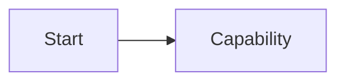
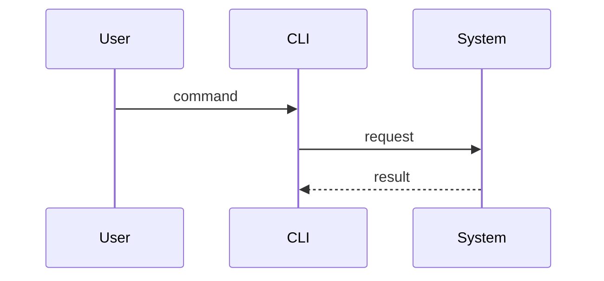

# Issue #<number>: <title>

## Links

- GitHub issue:
- Parent PRD:
- Related PRD section:

## Status

- Note status: draft
- Implementation status: not started
- Last reviewed:

## What This Issue Is Really About

Explain the issue in your own words.

Focus on the capability it creates, not the files you expect to edit.

## Why It Exists In The PRD

Relevant user stories:

- 

Relevant implementation decisions:

- 

What would be missing from DevAgentOps if this issue did not exist?

## Relevant ADRs

| ADR | Decision | Why it matters for this issue |
| --- | --- | --- |
| ADR-0000 |  |  |

## ADRs In My Own Words

### ADR-0000: <title>

We choose:

We do not choose:

Because V1 optimizes for:

The cost is:

We can revisit this if:

## Concepts And Vocabulary

Use the glossary terms from `CONTEXT.md`.

Key terms:

- 

Terms to avoid:

- 

## Architecture Diagram

ADR decision points on the diagram:

- 

## Flow Diagram

## Boundaries

In scope:

- 

Out of scope:

- 

## Public Interface

What should the user or caller be able to do after this issue is complete?

CLI/API/module interface:

- 

Expected observable outputs:

- 

## TDD Plan

First tracer bullet:

- Behavior:
- Public interface:
- Expected failure before implementation:
- Minimal green implementation:

Next behavior tests:

- 

Test boundaries:

- Do test:
- Do not test:

## Implementation Notes

Important constraints from the PRD or ADRs:

- 

Open questions:

- 

## Review After Implementation

What changed from my original understanding?

What trade-off became clearer?

What should the next issue know?

