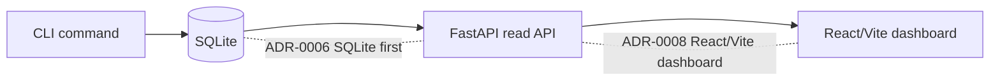

# Issue Notes Guide

This folder is for learning notes that connect GitHub issues, the PRD, ADRs, diagrams, and implementation work.

## Purpose

Each note should help you internalize one implementation slice before coding it. The goal is not to translate documents line by line. The goal is to explain the issue in your own words, recover the trade-offs behind the ADRs, and make the implementation boundary clear enough for TDD.

## File Naming

Use this format:

```text
Issue-<number> <short-title>.md
```

Examples:

```text
Issue-2 failure-type-taxonomy-and-case-policy.md
Issue-3 bootstrap-smoke-path.md
Issue-4 evaluation-matrix.md
```

## Required Sections

Every issue note should include:

- Issue link and parent PRD link.
- A short explanation of what the issue is trying to make possible.
- The relevant PRD user stories or implementation decisions.
- The ADRs that constrain this issue.
- Your own explanation of each ADR trade-off.
- Architecture diagram or flow diagram.
- A list of ADR decision points marked on the diagram.
- TDD entry point for implementation issues.
- A short review after implementation.

## Writing Standard

Prefer this shape when explaining ADRs:

```text
We choose X instead of Y.
Because V1 optimizes for A.
The cost is B.
If C becomes true later, we can revisit Y.
```

Avoid copying large sections from the PRD or ADRs. Quote only when exact wording matters.

## Diagram Standard

Use Mermaid diagrams by default. Keep diagrams small enough to explain one issue.

Good diagrams for this folder:

- Architecture diagram: components and boundaries.
- Flow diagram: user command, validation, persistence, report output.
- Sequence diagram: CLI, service, storage, validator, dashboard.

Mark ADRs directly near the decision point, for example:



## TDD Standard

For implementation issues, do not write all tests up front. Use one vertical tracer bullet at a time:

```text
RED: one behavior test fails
GREEN: minimal implementation passes
REFACTOR: clean up only after green
```

Tests should verify public behavior through CLI commands, API endpoints, or stable module interfaces. Avoid tests that depend on private helper names or internal data layout.

## Recommended Order

Start with:

1. Issue #2: failure type taxonomy and case policy.
2. Issue #3: bootstrap CLI, FastAPI, SQLite, and React smoke path.
3. Issue #4: evaluation matrix conditions with defaults and fingerprints.
4. Issue #5: component registry entries.
5. Issue #6: offline case packages and suite manifests.

